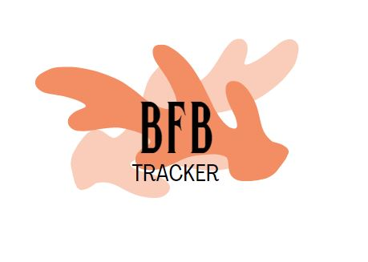
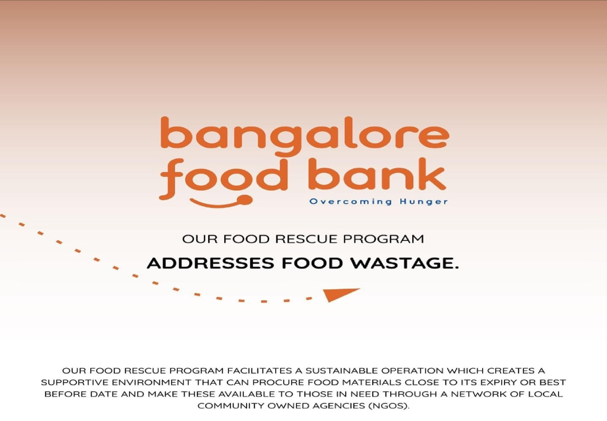

<div id="top"></div>

<br />
<div align="center">
    
  </a>

  <h3 align="center">BFB Tracker</h3>

  <p align="center">
    A Solution for BFB to Maintain Data
    <br />
    <br />
    <br />
    View Demo
    ·
   Report Bug
    ·
   Request Feature
  </p>
</div>


<!-- TABLE OF CONTENTS -->
<details>
  <summary>Table of Contents</summary>
  <ol>
    <li>
      <a href="#about-the-project">About The Project</a>
      <ul>
        <li><a href="#built-with">Built With</a></li>
      </ul>
    </li>
    <li>
      <a href="#getting-started">Getting Started</a>
      <ul>
        <li><a href="#prerequisites">Prerequisites</a></li>
        <li><a href="#installation">Installation</a></li>
      </ul>
      </li>
    <li><a href="#roadmap">Roadmap</a></li>
    <li><a href="#contributing">Contributing</a></li>
    <li><a href="#license">License</a></li>
    <li><a href="#contact">Contact</a></li>
  </ol>
</details>


<!-- ABOUT THE PROJECT -->
## About The Project



Banglore Food Bank is an organisation whose mission is to eradicate hunger,malnutrition&prevent food wastage.The purpose is to feed those who are unable to feed themselves.

Currently, th process of tracking the proress is completely manual,which makes it difficult to organizarion to visualize and analyze the particular task at a given point of time.

BFB Tracker is a One Stop Solution for the organization to track the history and visualize the data throught this website of all the NGO's at a single time without having headache of getting manual entries.

BFB Tracker is having every feature that the orgsnization requires for getting data digitally. The admin as well as the NGO can use the website to give input(NGO) and show the given input(admin).

This will give the proper information about the NGO gettings,under which program the NGO has taken food and also admin can keep track of all the NGO's.
Key Features :
* Admin can easily visualize the data here and can read see many types of visualizations. The NGO information , from charts to visualize the data.
* The, our unqiue **Admin Login** provides admin the access to fetch the historical data with selected date range and analyze the data comparitive to manual    submission.

<p align="right">(<a href="#top">back to top</a>)</p>


### Built With

This project was built with the following frameworks and technologies:

* [Node.js](https://nodejs.org/en/)
* [Express Framework](https://expressjs.com/)
* [MongoDB](https://www.mongodb.com/)
* [Bootstrap](https://getbootstrap.com)
* [Javascript](https://www.w3schools.com/js/)
* [JQuery](https://jquery.com)
* [NSEDownload Python Library (to obtain historical stock market data)](https://github.com/NSEDownload/NSEDownload)
* [Trading View APIs](https://in.tradingview.com/)


<p align="right">(<a href="#top">back to top</a>)</p>


<!-- GETTING STARTED -->
## Getting Started

Follow the steps given below to run the project locally on your system.

### Prerequisites

* npm
  ```sh
  npm install npm@latest -g
  npm install nodemon@latest -g
  ```

### Installation

_Once all the prerequisites are met, the required API Keys and dependencies must be installed._

1. Get a free Google OAuth API Key at [https://cloud.google.com/](https://cloud.google.com/)
2. Add the URIs `http://localhost:9000` in `Authorized JavaScript origins` tab, and `http://localhost:9000/auth/google`, `http://localhost:9000/auth/google/callback` in `Authorized redirect URIs` tab.
3. Create a free MongoDB Atlas cluster at [https://www.mongodb.com/atlas](https://www.mongodb.com/atlas)
4. Clone the repo
   ```sh
   git clone repo-url
   ```
3. Install NPM packages
   ```sh
   npm install
   ```
4. Create the .env file
   ```sh
   cp .env.example .env
   ```
5. In the .env file, enter your credentials generated in the above steps (google OAuth details can be found in the google cloud console and mongoDB access URI from the mongoDB cluster dashboard ).
6. Good to go! Start the project locally using the following command, and go to [http://localhost:9000](http://localhost:9000)
   ```sh
   npm start
   ```

<p align="right">(<a href="#top">back to top</a>)</p>


<!-- USAGE EXAMPLES -->


<p align="right">(<a href="#top">back to top</a>)</p>


<!-- ROADMAP -->
## Roadmap

- [x] Think of a unique idea!
- [x] Implement the project.
- [x] Add a README.md
- [ ] Deploy the project
- [ ] Expand the scope of the project, to other areas that might help users in their stock market trading.


<p align="right">(<a href="#top">back to top</a>)</p>


<!-- CONTRIBUTING -->
## Contributing

Contributions are what make the open source community such an amazing place to learn, inspire, and create. Any contributions you make are **greatly appreciated**.

If you have a suggestion that would make this better, please fork the repo and create a pull request. You can also simply open an issue with the tag "enhancement".
Don't forget to give the project a star! Thanks again!

1. Fork the Project
2. Create your Feature Branch (`git checkout -b feature/AmazingFeature`)
3. Commit your Changes (`git commit -m 'Add some AmazingFeature'`)
4. Push to the Branch (`git push origin feature/AmazingFeature`)
5. Open a Pull Request

<p align="right">(<a href="#top">back to top</a>)</p>


<!-- LICENSE -->
## License

This project is licensed under the Apache 2.0 License. See `LICENSE` for more information.

<p align="right">(<a href="#top">back to top</a>)</p>


<p align="right">(<a href="#top">back to top</a>)</p>
